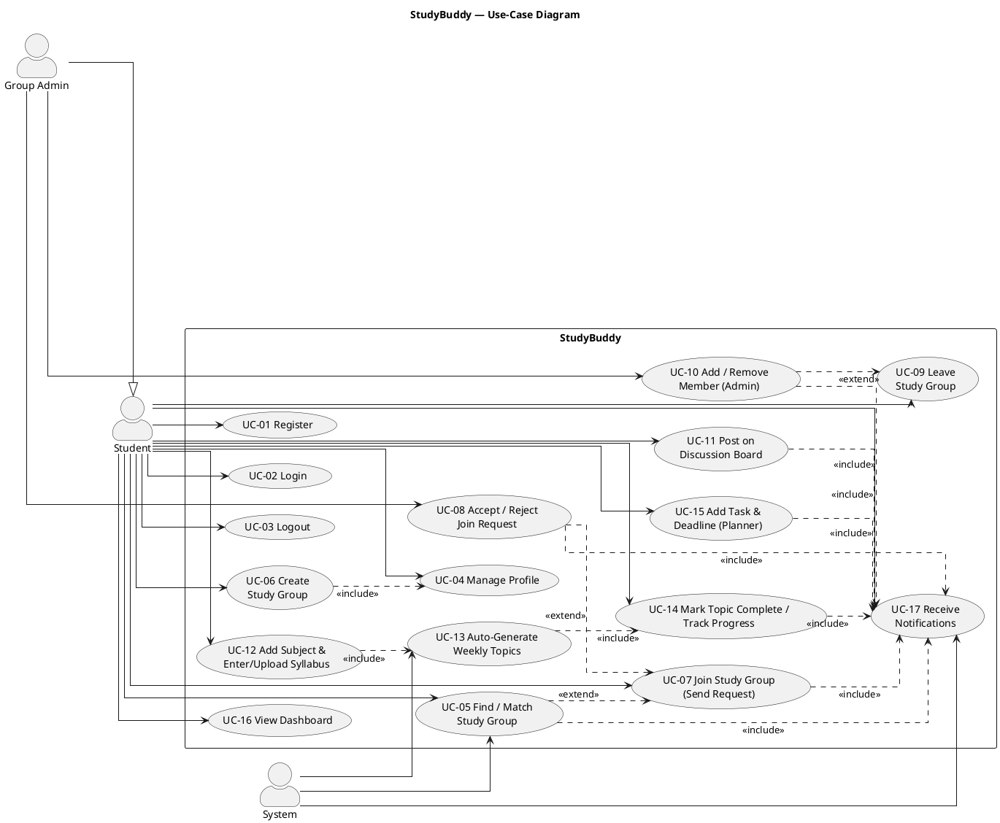
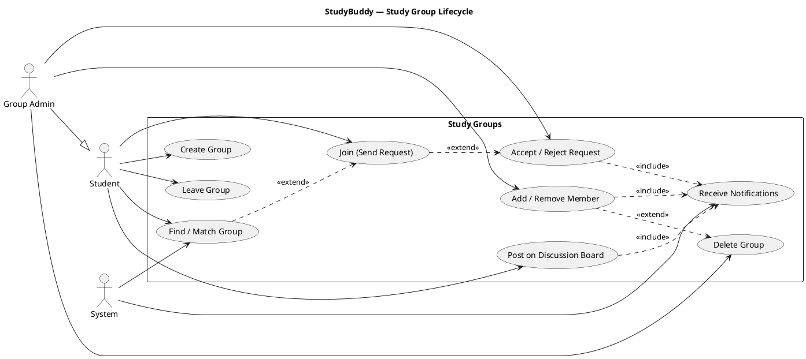

# StudyBuddy — Use-Case Diagram

**Project:** StudyBuddy — A web application that helps university students find study partners, create/join study groups, break syllabi into weekly topics, track academic progress, and plan study tasks.

**Document:** Use-Case Diagram (PlantUML)
**Version:** 1.0
**Date:** 2026-06-13

This document provides the graphical use-case model for StudyBuddy as PlantUML source. It complements the textual specifications in `03-use-cases.md`.

---

## 1. Actors

- **Student** — general authenticated user.
- **Group Admin** — a Student who owns a group (generalization: Group Admin *is a* Student).
- **System** — automated backend (matching, topic generation, progress computation, notifications).

---

## 2. Full Use-Case Diagram

---

## 3. Focused Sub-Diagram — Study Group Lifecycle

A smaller diagram zooming into the group/membership workflow, useful for presentations.

---

## 4. Legend

| Notation | Meaning |
|----------|---------|
| **Actor (stick figure)** | A role interacting with the system (Student, Group Admin, System). |
| **Oval (use case)** | A discrete unit of functionality. |
| **Solid line** (actor — use case) | Association: the actor participates in the use case. |
| **Hollow triangle arrow** `--|>` | Generalization: *Group Admin is a Student* and inherits all Student use cases. |
| **Dashed arrow `<<include>>`** | The base use case **always** invokes the included use case as part of its flow. |
| **Dashed arrow `<<extend>>`** | The extending use case **conditionally** adds behavior to the base use case. |

**Key relationships captured:**
- *Group Admin* generalizes *Student* — admins can do everything a student can, plus admin-only actions (UC-08, UC-10).
- *Add Subject & Syllabus* (UC-12) **includes** *Auto-Generate Weekly Topics* (UC-13), which in turn **includes** *Track Progress* (UC-14) via baseline initialization.
- Notification-emitting use cases (UC-05, UC-07, UC-08, UC-10, UC-11, UC-14, UC-15) **include** *Receive Notifications* (UC-17).
- *Find/Match* (UC-05) and *Accept/Reject* (UC-08) **extend** *Join Study Group* (UC-07).

---

## 5. Rendering Instructions

You can render the PlantUML diagrams above using any of the following:

**Option A — Online (no install):**
1. Go to <https://www.plantuml.com/plantuml>.
2. Paste the code from a `@startuml … @enduml` block.
3. The diagram renders instantly; export as PNG/SVG.

**Option B — VS Code (recommended):**
1. Install the **PlantUML** extension (by jebbs) from the Marketplace.
2. Install a local renderer dependency: **Java (JRE 8+)** and **Graphviz** (`dot`), or configure the extension to use the public PlantUML server.
3. Open this Markdown file, place the cursor inside a `plantuml` block, and press `Alt+D` to preview, or use *PlantUML: Export Current Diagram*.

**Option C — CLI:**
1. Download `plantuml.jar` from <https://plantuml.com/download>.
2. Save a block to `diagram.puml` and run: `java -jar plantuml.jar diagram.puml` to produce `diagram.png`.

> **Tip:** Markdown viewers such as GitHub do not render PlantUML natively. Use one of the methods above, or a Markdown-with-PlantUML renderer, to view the diagrams.
