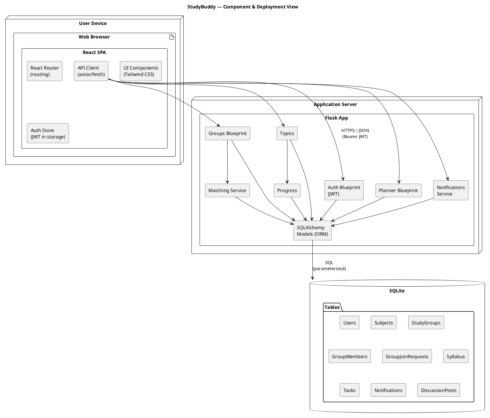
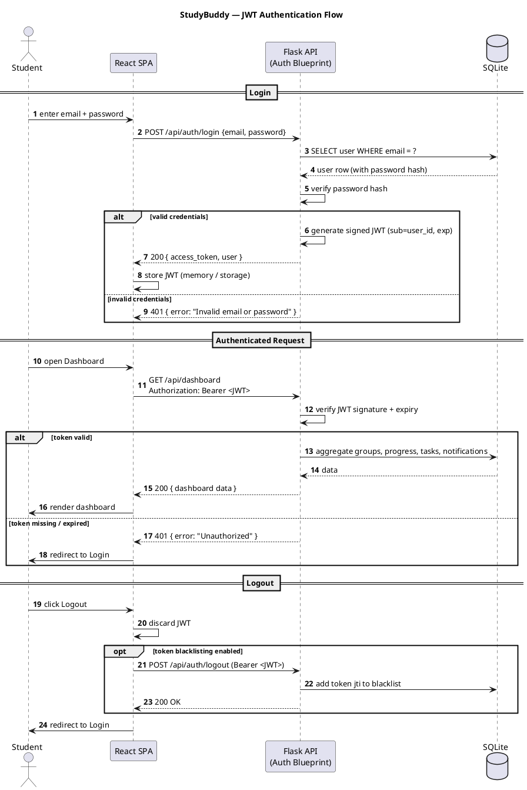

# StudyBuddy — System Architecture

**Project:** StudyBuddy — A web application that helps university students find study partners, create/join study groups, break syllabi into weekly topics, track academic progress, and plan study tasks.

**Stack:** React.js + Tailwind CSS + React Router (frontend); Python Flask + Flask-SQLAlchemy + JWT auth (backend); SQLite database.

**Document:** System Architecture
**Version:** 1.0
**Date:** 2026-06-13

---

## 1. Architecture Overview

StudyBuddy follows a classic **three-tier architecture** that cleanly separates presentation, application logic, and data:

1. **Presentation Tier — React SPA (Client).**
   A single-page application built with **React.js**, styled with **Tailwind CSS**, and routed with **React Router**. It runs entirely in the browser, renders all views (Dashboard, Profile, Find Group, Group page, Syllabus/Topics, Progress, Planner, Notifications), and communicates with the backend exclusively over a **REST API** using JSON. It holds no business rules of record — it consumes API data and manages local/UI state and the JWT.

2. **Application Tier — Flask REST API (Server).**
   A **Python Flask** application exposing stateless REST endpoints. It enforces business rules (matching, membership, topic generation, progress and streak computation, notification dispatch), validates input, and handles **JWT-based authentication and authorization**. Data access goes through **Flask-SQLAlchemy** (an ORM), keeping SQL out of the route handlers.

3. **Data Tier — SQLite Database.**
   A file-based **SQLite** database accessed via SQLAlchemy models. It persists all domain entities: `Users`, `Subjects`, `StudyGroups`, `GroupMembers`, `GroupJoinRequests`, `Syllabus`, `Topics`, `Progress`, `Tasks`, `Notifications`, `DiscussionPosts`.

**Why three tiers:** separation of concerns, independent scaling/replacement of layers, testability of the API in isolation, and a clear contract (REST + JSON) between client and server. SQLite keeps the deployment simple for a university project while SQLAlchemy keeps the door open for a later migration to PostgreSQL/MySQL with minimal code change.

```
+--------------------+        HTTPS / JSON        +-----------------------+        SQLAlchemy ORM        +----------------+
|  React SPA (Client)| <------------------------> |  Flask REST API       | <--------------------------> |  SQLite DB     |
|  React Router      |   Bearer JWT in header     |  Blueprints/Services  |   parameterized queries      |  studybuddy.db |
|  Tailwind CSS      |                            |  JWT auth middleware  |                              |  11 tables     |
+--------------------+                            +-----------------------+                              +----------------+
       Presentation Tier                                 Application Tier                                    Data Tier
```

---

## 2. Component / Deployment Diagram (PlantUML)



---

## 3. Request / Response Flow

A typical authenticated request travels through the tiers as follows:

1. **User action** in the React SPA (e.g., clicking "Request to Join" on a group).
2. **API client** builds an HTTP request (method + path + JSON body) and attaches the JWT as an `Authorization: Bearer <token>` header.
3. **Flask routing** dispatches the request to the matching blueprint/route.
4. **JWT middleware** validates the token signature and expiry, and loads the current user identity.
5. **Authorization check** confirms the user may perform the action (e.g., is a member/admin).
6. **Validation** of the request body (required fields, types, constraints).
7. **Business logic / service layer** executes (e.g., create a `GroupJoinRequests` row, queue a notification).
8. **SQLAlchemy ORM** persists/reads data from SQLite within a transaction.
9. **Serialization** of the result into a JSON response with an appropriate HTTP status (200/201/400/401/403/404/409/500).
10. **React** receives the JSON, updates state, and re-renders the affected UI.

**Conventions:**
- **Stateless server:** no server-side session; every request carries the JWT.
- **Status codes:** `200 OK`, `201 Created`, `400 Bad Request` (validation), `401 Unauthorized` (missing/expired token), `403 Forbidden` (not allowed), `404 Not Found`, `409 Conflict` (e.g., duplicate/full group), `500 Internal Server Error`.
- **Error shape:** `{ "error": "message", "details": { ... } }` for consistent client handling.
- **CORS:** enabled on the Flask side (e.g., `flask-cors`) so the SPA origin can call the API.

---

## 4. Authentication Flow (JWT) — Sequence Diagram



**Notes:**
- Passwords are stored as **salted hashes** (e.g., `werkzeug.security` / bcrypt); plaintext is never persisted.
- JWTs are **signed** with a server secret and carry `sub` (user id) and `exp` (expiry). Optionally a refresh token supports "remember me".
- Protected routes use a decorator (e.g., `@jwt_required`) that rejects missing/expired/invalid tokens with `401`.

---

## 5. API Layer Description

The API is organized into **blueprints** (modular route groups), each backed by service functions and SQLAlchemy models. Representative endpoints (illustrative; `/api` prefix, JSON bodies):

| Area | Method & Path | Purpose | Use Case |
|------|---------------|---------|----------|
| Auth | `POST /api/auth/register` | Create account | UC-01 |
| Auth | `POST /api/auth/login` | Authenticate, issue JWT | UC-02 |
| Auth | `POST /api/auth/logout` | Invalidate token (optional) | UC-03 |
| Profile | `GET /api/users/me` | Get current profile | UC-04 |
| Profile | `PUT /api/users/me` | Update profile / availability | UC-04 |
| Subjects | `POST /api/subjects` | Add subject | UC-12 |
| Syllabus | `POST /api/subjects/{id}/syllabus` | Enter/upload syllabus | UC-12 |
| Topics | `POST /api/subjects/{id}/topics/generate` | Auto-generate weekly topics | UC-13 |
| Topics | `GET /api/subjects/{id}/topics` | List weekly topics | UC-13/14 |
| Progress | `PATCH /api/topics/{id}` | Mark topic complete/incomplete | UC-14 |
| Progress | `GET /api/subjects/{id}/progress` | Get progress %, streak | UC-14 |
| Matching | `GET /api/groups/match` | Ranked group/partner matches | UC-05 |
| Groups | `POST /api/groups` | Create group | UC-06 |
| Groups | `GET /api/groups/{id}` | Group details | — |
| Groups | `POST /api/groups/{id}/requests` | Send join request | UC-07 |
| Groups | `POST /api/groups/{id}/requests/{rid}` | Accept/reject request | UC-08 |
| Groups | `DELETE /api/groups/{id}/members/me` | Leave group | UC-09 |
| Groups | `POST /api/groups/{id}/members` | Add member (admin) | UC-10 |
| Groups | `DELETE /api/groups/{id}/members/{uid}` | Remove member (admin) | UC-10 |
| Groups | `DELETE /api/groups/{id}` | Delete group (admin) | UC-10 |
| Discussion | `GET/POST /api/groups/{id}/posts` | Read/post discussion | UC-11 |
| Planner | `GET/POST /api/tasks` | List/create tasks | UC-15 |
| Planner | `PATCH/DELETE /api/tasks/{id}` | Update/complete/delete task | UC-15 |
| Dashboard | `GET /api/dashboard` | Aggregated overview | UC-16 |
| Notifications | `GET /api/notifications` | List notifications | UC-17 |
| Notifications | `PATCH /api/notifications/{id}` | Mark read | UC-17 |

**Cross-cutting concerns:**
- **Validation** — request schemas validated before logic runs (e.g., with Marshmallow or manual checks).
- **Authorization** — role/ownership checks (member vs. admin) enforced per route.
- **Serialization** — models serialized to JSON consistently (schemas).
- **Error handling** — centralized error handlers map exceptions to JSON + status code.
- **Pagination** — list endpoints (notifications, discussion posts, matches) support `?page=&limit=`.

---

## 6. Folder-Structure Overview

### 6.1 Frontend (React)

```
frontend/
├── public/
│   └── index.html
├── src/
│   ├── api/                # API client wrappers (axios instance, endpoints)
│   │   ├── client.js       # base axios instance, attaches JWT
│   │   ├── auth.js
│   │   ├── groups.js
│   │   ├── subjects.js
│   │   ├── topics.js
│   │   ├── tasks.js
│   │   └── notifications.js
│   ├── components/         # reusable UI (buttons, cards, modals, ProgressBar)
│   ├── features/           # feature-grouped UI + logic
│   │   ├── auth/           # Login, Register
│   │   ├── profile/        # Manage Profile
│   │   ├── groups/         # Find, Create, Group page, Requests, Members, Discussion
│   │   ├── syllabus/       # Add subject, syllabus, weekly topics
│   │   ├── progress/       # Progress bars, streak, weekly targets
│   │   ├── planner/        # Tasks, weekly/monthly views
│   │   ├── dashboard/      # Dashboard widgets
│   │   └── notifications/  # Notifications panel
│   ├── routes/             # React Router route definitions + guards
│   │   ├── AppRouter.jsx
│   │   └── ProtectedRoute.jsx
│   ├── context/            # AuthContext (JWT/user), global state
│   ├── hooks/              # custom hooks (useAuth, useFetch)
│   ├── styles/             # Tailwind config entry, globals.css
│   ├── utils/              # formatters, date helpers, validators
│   ├── App.jsx
│   └── main.jsx
├── tailwind.config.js
├── postcss.config.js
└── package.json
```

### 6.2 Backend (Flask)

```
backend/
├── app/
│   ├── __init__.py         # app factory, extension init (SQLAlchemy, JWT, CORS)
│   ├── config.py           # config classes (dev/test/prod), SQLite URI, secrets
│   ├── extensions.py       # db = SQLAlchemy(), jwt = JWTManager()
│   ├── models/             # SQLAlchemy models (one per table or grouped)
│   │   ├── user.py
│   │   ├── subject.py
│   │   ├── study_group.py  # StudyGroups, GroupMembers, GroupJoinRequests
│   │   ├── syllabus.py     # Syllabus, Topics
│   │   ├── progress.py
│   │   ├── task.py
│   │   ├── notification.py
│   │   └── discussion.py   # DiscussionPosts
│   ├── schemas/            # serialization/validation schemas
│   ├── blueprints/         # route groups
│   │   ├── auth.py
│   │   ├── users.py
│   │   ├── subjects.py
│   │   ├── topics.py
│   │   ├── groups.py
│   │   ├── discussion.py
│   │   ├── planner.py
│   │   ├── dashboard.py
│   │   └── notifications.py
│   ├── services/           # business logic
│   │   ├── matching.py     # smart matching algorithm
│   │   ├── topic_gen.py    # syllabus -> weekly topics
│   │   ├── progress.py     # percentages, streaks, weekly targets
│   │   └── notify.py       # notification dispatch
│   └── utils/              # decorators (jwt_required wrappers), errors, helpers
├── migrations/             # Alembic migrations (Flask-Migrate)
├── instance/
│   └── studybuddy.db       # SQLite database file
├── tests/                  # pytest unit/integration tests
├── requirements.txt
└── run.py                  # entrypoint (creates app, runs server)
```

---

## 7. Non-Functional Considerations

- **Security:** hashed passwords, signed JWTs with expiry, authorization checks per route, parameterized ORM queries (SQL-injection safe), HTTPS in deployment, CORS restricted to the SPA origin.
- **Performance:** indexed foreign keys, paginated list endpoints, client-side caching of relatively static data (profile, group lists).
- **Maintainability:** clear three-tier separation, blueprint + service layering, ORM models decoupled from routes — enabling a later DB swap (SQLite → PostgreSQL) with minimal change.
- **Usability (HCI focus):** responsive Tailwind UI, progress bars and streaks for motivation, dashboard for at-a-glance status, and timely notifications/reminders.
- **Testability:** the stateless REST API can be tested in isolation with `pytest`; the SPA with component tests.

---

## 8. Traceability

Every architectural element maps back to the use cases in `03-use-cases.md` and the diagram in `04-use-case-diagram.md`: blueprints and services implement the use-case flows, the ORM models correspond to the eleven canonical database tables, and the JWT auth flow underpins all protected use cases (UC-04 through UC-17).
