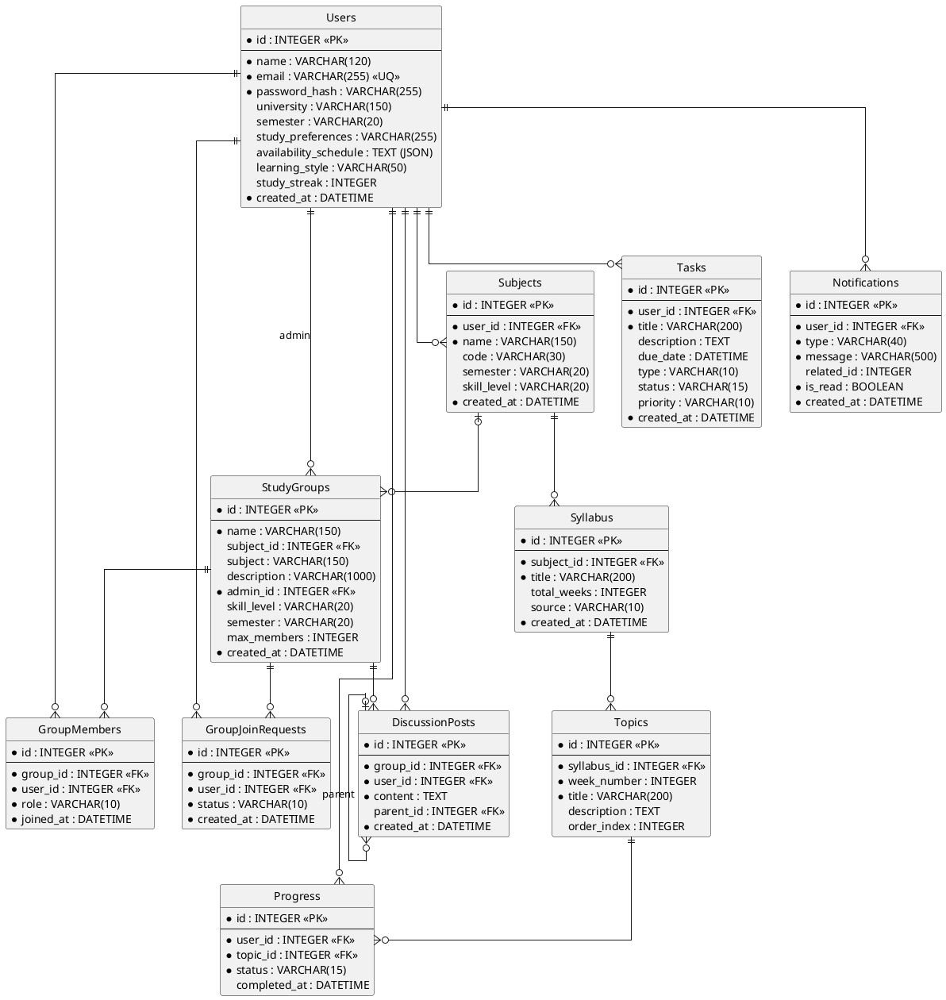

# StudyBuddy — Database Design Document

**Document:** 06 — Database Design
**Project:** StudyBuddy (Find study partners, form study groups, break syllabi into weekly topics, track progress, and plan study tasks)
**Stack:** Flask + Flask-SQLAlchemy, SQLite (portable to MySQL)
**Date:** 2026-06-13

---

## 1. Overview & Design Rationale

### 1.1 Purpose

StudyBuddy is a web application that helps university students discover compatible study partners, organise themselves into study groups, decompose a course syllabus into weekly topics, track per-topic learning progress, and plan personal study tasks and deadlines. The persistence layer must support:

- **User profiles** rich enough to power partner matching (preferences, availability, learning style).
- **Subjects** each student is taking.
- **Study groups** with an admin, membership, and a join-request workflow.
- **Syllabi** broken into weekly **topics**, with per-user **progress**.
- Personal **tasks/deadlines**, in-app **notifications**, and group **discussion** threads.

### 1.2 Design Principles

1. **Normalization to 3NF.** Every non-key attribute depends on the key, the whole key, and nothing but the key.
   - Membership is modelled as the `GroupMembers` junction (resolving the M:N between `Users` and `StudyGroups`) rather than repeating user data on the group.
   - Join requests are a separate `GroupJoinRequests` entity so a request has its own lifecycle independent of membership.
   - Progress is a junction (`Progress`) between `Users` and `Topics` with a uniqueness guarantee, avoiding repeating-group columns on either side.
   - Syllabus → Topics → Progress is a clean hierarchy; topic ordering is captured with an explicit `order_index` rather than relying on insertion order.

2. **Surrogate keys everywhere.** Every table has an integer surrogate primary key `id`. Natural keys that must be unique (e.g. `Users.email`) are enforced with `UNIQUE` constraints, not used as PKs — this keeps FKs narrow and stable.

3. **Referential integrity.** All relationships are enforced with `FOREIGN KEY` constraints. Deletes cascade where a child cannot exist without its parent (e.g. a `Topic` cannot exist without its `Syllabus`), and are restricted/nulled where the child has independent meaning.

4. **Controlled vocabularies via CHECK.** Status/role/type enumerations are enforced with `CHECK (col IN (...))` constraints, which work identically on SQLite and MySValL and avoid the portability headaches of native `ENUM`.

5. **Auditability.** Every table carries a `created_at` timestamp defaulting to the current time.

### 1.3 Naming Conventions

| Element | Convention | Example |
|---|---|---|
| Table names | `PascalCase`, plural | `StudyGroups`, `GroupJoinRequests` |
| Column names | `snake_case` | `password_hash`, `due_date` |
| Primary key | `id` | `id` |
| Foreign key | `<referenced_singular>_id` | `user_id`, `group_id`, `syllabus_id` |
| Timestamps | `*_at` | `created_at`, `completed_at`, `joined_at` |
| Booleans | `is_*` | `is_read` |
| Indexes | `idx_<table>_<cols>` | `idx_progress_user` |
| Unique constraints | `uq_<table>_<cols>` | `uq_progress_user_topic` |

---

## 2. ER Diagram

### 2.1 Mermaid (`erDiagram`)

```mermaid
erDiagram
    Users ||--o{ Subjects : "owns"
    Users ||--o{ StudyGroups : "administers"
    Users ||--o{ GroupMembers : "is member"
    StudyGroups ||--o{ GroupMembers : "has member"
    Users ||--o{ GroupJoinRequests : "requests"
    StudyGroups ||--o{ GroupJoinRequests : "receives"
    Subjects ||--o{ Syllabus : "has"
    Syllabus ||--o{ Topics : "contains"
    Users ||--o{ Progress : "tracks"
    Topics ||--o{ Progress : "tracked by"
    Users ||--o{ Tasks : "plans"
    Users ||--o{ Notifications : "receives"
    StudyGroups ||--o{ DiscussionPosts : "hosts"
    Users ||--o{ DiscussionPosts : "writes"
    DiscussionPosts ||--o{ DiscussionPosts : "replies to"

    Users {
        int id PK
        string name
        string email UK
        string password_hash
        string university
        string semester
        string study_preferences
        text availability_schedule "JSON"
        string learning_style
        int study_streak
        datetime created_at
    }
    Subjects {
        int id PK
        int user_id FK
        string name
        string code
        string semester
        string skill_level
        datetime created_at
    }
    StudyGroups {
        int id PK
        string name
        int subject_id FK "nullable"
        string subject
        string description
        int admin_id FK
        string skill_level
        string semester
        int max_members
        datetime created_at
    }
    GroupMembers {
        int id PK
        int group_id FK
        int user_id FK
        string role "admin/member"
        datetime joined_at
    }
    GroupJoinRequests {
        int id PK
        int group_id FK
        int user_id FK
        string status "pending/accepted/rejected"
        datetime created_at
    }
    Syllabus {
        int id PK
        int subject_id FK
        string title
        int total_weeks
        string source "uploaded/manual"
        datetime created_at
    }
    Topics {
        int id PK
        int syllabus_id FK
        int week_number
        string title
        text description
        int order_index
    }
    Progress {
        int id PK
        int user_id FK
        int topic_id FK
        string status "not_started/in_progress/completed"
        datetime completed_at
    }
    Tasks {
        int id PK
        int user_id FK
        string title
        text description
        datetime due_date
        string type "task/deadline"
        string status
        string priority
        datetime created_at
    }
    Notifications {
        int id PK
        int user_id FK
        string type
        string message
        int related_id
        boolean is_read
        datetime created_at
    }
    DiscussionPosts {
        int id PK
        int group_id FK
        int user_id FK
        text content
        int parent_id FK "nullable"
        datetime created_at
    }
```



### 2.2 PlantUML (alternative)



---

## 3. Entity Descriptions

### 3.1 Users

The central entity. Stores authentication credentials (email + bcrypt/werkzeug `password_hash`) and the rich profile data used for partner matching: study preferences, a JSON availability schedule, and learning style. `study_streak` is a denormalised counter maintained by the application for gamification.

| Column | Type | Constraints | Description |
|---|---|---|---|
| id | INTEGER | PK, autoincrement | Surrogate key |
| name | VARCHAR(120) | NOT NULL | Display name |
| email | VARCHAR(255) | NOT NULL, UNIQUE | Login identifier |
| password_hash | VARCHAR(255) | NOT NULL | Hashed password (never plaintext) |
| university | VARCHAR(150) | NULL | Institution name |
| semester | VARCHAR(20) | NULL | Current semester, e.g. `Fall-2026` |
| study_preferences | VARCHAR(255) | NULL | Free-text/CSV preferences |
| availability_schedule | TEXT | NULL | JSON weekly availability |
| learning_style | VARCHAR(50) | NULL | e.g. `visual`, `auditory` |
| study_streak | INTEGER | NOT NULL, DEFAULT 0 | Consecutive active days |
| created_at | DATETIME | NOT NULL, DEFAULT now | Registration timestamp |

### 3.2 Subjects

A subject (course) a particular student is taking. Owned by exactly one user, so partner matching and syllabus tracking are per-student.

| Column | Type | Constraints | Description |
|---|---|---|---|
| id | INTEGER | PK | Surrogate key |
| user_id | INTEGER | NOT NULL, FK → Users(id) ON DELETE CASCADE | Owner |
| name | VARCHAR(150) | NOT NULL | Subject name |
| code | VARCHAR(30) | NULL | Course code, e.g. `CS-201` |
| semester | VARCHAR(20) | NULL | Semester taken |
| skill_level | VARCHAR(20) | CHECK in (beginner, intermediate, advanced) | Self-rated level |
| created_at | DATETIME | NOT NULL, DEFAULT now | Created timestamp |

### 3.3 StudyGroups

A group of students studying together. Has one admin (`admin_id` → Users) and may optionally reference a `Subjects` row (`subject_id`); a free-text `subject` label is also kept for groups not bound to a specific student's subject record. `max_members` caps membership.

| Column | Type | Constraints | Description |
|---|---|---|---|
| id | INTEGER | PK | Surrogate key |
| name | VARCHAR(150) | NOT NULL | Group name |
| subject_id | INTEGER | NULL, FK → Subjects(id) ON DELETE SET NULL | Optional linked subject |
| subject | VARCHAR(150) | NULL | Free-text subject label |
| description | VARCHAR(1000) | NULL | Group description |
| admin_id | INTEGER | NOT NULL, FK → Users(id) ON DELETE CASCADE | Group administrator |
| skill_level | VARCHAR(20) | CHECK in (beginner, intermediate, advanced, mixed) | Target level |
| semester | VARCHAR(20) | NULL | Semester |
| max_members | INTEGER | NOT NULL, DEFAULT 8, CHECK > 0 | Capacity |
| created_at | DATETIME | NOT NULL, DEFAULT now | Created timestamp |

### 3.4 GroupMembers

Junction resolving the **M:N** between `Users` and `StudyGroups`. A user appears at most once per group (unique pair). `role` distinguishes the admin from ordinary members.

| Column | Type | Constraints | Description |
|---|---|---|---|
| id | INTEGER | PK | Surrogate key |
| group_id | INTEGER | NOT NULL, FK → StudyGroups(id) ON DELETE CASCADE | Group |
| user_id | INTEGER | NOT NULL, FK → Users(id) ON DELETE CASCADE | Member |
| role | VARCHAR(10) | NOT NULL, DEFAULT 'member', CHECK in (admin, member) | Member role |
| joined_at | DATETIME | NOT NULL, DEFAULT now | Join timestamp |
| | | UNIQUE(group_id, user_id) | No duplicate membership |

### 3.5 GroupJoinRequests

Tracks a user's request to join a group through its lifecycle (`pending` → `accepted`/`rejected`). Kept separate from membership so a rejected/historical request is retained.

| Column | Type | Constraints | Description |
|---|---|---|---|
| id | INTEGER | PK | Surrogate key |
| group_id | INTEGER | NOT NULL, FK → StudyGroups(id) ON DELETE CASCADE | Target group |
| user_id | INTEGER | NOT NULL, FK → Users(id) ON DELETE CASCADE | Requesting user |
| status | VARCHAR(10) | NOT NULL, DEFAULT 'pending', CHECK in (pending, accepted, rejected) | Request state |
| created_at | DATETIME | NOT NULL, DEFAULT now | Requested timestamp |

### 3.6 Syllabus

A syllabus belongs to a subject and is the container for weekly topics. `source` records whether it was uploaded (parsed from a file) or entered manually.

| Column | Type | Constraints | Description |
|---|---|---|---|
| id | INTEGER | PK | Surrogate key |
| subject_id | INTEGER | NOT NULL, FK → Subjects(id) ON DELETE CASCADE | Owning subject |
| title | VARCHAR(200) | NOT NULL | Syllabus title |
| total_weeks | INTEGER | CHECK > 0 | Planned duration |
| source | VARCHAR(10) | NOT NULL, DEFAULT 'manual', CHECK in (uploaded, manual) | Origin |
| created_at | DATETIME | NOT NULL, DEFAULT now | Created timestamp |

### 3.7 Topics

A single weekly topic within a syllabus. `order_index` gives an explicit display order independent of `week_number` (e.g. multiple topics in one week).

| Column | Type | Constraints | Description |
|---|---|---|---|
| id | INTEGER | PK | Surrogate key |
| syllabus_id | INTEGER | NOT NULL, FK → Syllabus(id) ON DELETE CASCADE | Parent syllabus |
| week_number | INTEGER | NOT NULL, CHECK > 0 | Week this topic falls in |
| title | VARCHAR(200) | NOT NULL | Topic title |
| description | TEXT | NULL | Detail |
| order_index | INTEGER | NOT NULL, DEFAULT 0 | Sort order |

### 3.8 Progress

Junction resolving the **M:N** between `Users` and `Topics` — one row per (user, topic) tracking learning status. `UNIQUE(user_id, topic_id)` enforces a single progress record per pairing. `completed_at` is set when status becomes `completed`.

| Column | Type | Constraints | Description |
|---|---|---|---|
| id | INTEGER | PK | Surrogate key |
| user_id | INTEGER | NOT NULL, FK → Users(id) ON DELETE CASCADE | Student |
| topic_id | INTEGER | NOT NULL, FK → Topics(id) ON DELETE CASCADE | Topic |
| status | VARCHAR(15) | NOT NULL, DEFAULT 'not_started', CHECK in (not_started, in_progress, completed) | State |
| completed_at | DATETIME | NULL | Completion time |
| | | UNIQUE(user_id, topic_id) | One record per pair |

### 3.9 Tasks

Personal study tasks and deadlines owned by a user. `type` distinguishes a to-do `task` from a `deadline`.

| Column | Type | Constraints | Description |
|---|---|---|---|
| id | INTEGER | PK | Surrogate key |
| user_id | INTEGER | NOT NULL, FK → Users(id) ON DELETE CASCADE | Owner |
| title | VARCHAR(200) | NOT NULL | Task title |
| description | TEXT | NULL | Detail |
| due_date | DATETIME | NULL | When due |
| type | VARCHAR(10) | NOT NULL, DEFAULT 'task', CHECK in (task, deadline) | Kind |
| status | VARCHAR(15) | NOT NULL, DEFAULT 'pending', CHECK in (pending, in_progress, done) | State |
| priority | VARCHAR(10) | NOT NULL, DEFAULT 'medium', CHECK in (low, medium, high) | Priority |
| created_at | DATETIME | NOT NULL, DEFAULT now | Created timestamp |

### 3.10 Notifications

In-app notifications addressed to a user. `related_id` is a soft (polymorphic) reference to the entity that triggered the notification (interpreted via `type`); it is intentionally **not** a FK, since the target table varies.

| Column | Type | Constraints | Description |
|---|---|---|---|
| id | INTEGER | PK | Surrogate key |
| user_id | INTEGER | NOT NULL, FK → Users(id) ON DELETE CASCADE | Recipient |
| type | VARCHAR(40) | NOT NULL | Category, e.g. `join_request` |
| message | VARCHAR(500) | NOT NULL | Display text |
| related_id | INTEGER | NULL | Soft reference to source entity |
| is_read | BOOLEAN | NOT NULL, DEFAULT 0 | Read flag |
| created_at | DATETIME | NOT NULL, DEFAULT now | Created timestamp |

### 3.11 DiscussionPosts

Threaded discussion within a group. `parent_id` is a self-referencing FK: a `NULL` parent is a top-level post, a non-null parent is a reply.

| Column | Type | Constraints | Description |
|---|---|---|---|
| id | INTEGER | PK | Surrogate key |
| group_id | INTEGER | NOT NULL, FK → StudyGroups(id) ON DELETE CASCADE | Host group |
| user_id | INTEGER | NOT NULL, FK → Users(id) ON DELETE CASCADE | Author |
| content | TEXT | NOT NULL | Post body |
| parent_id | INTEGER | NULL, FK → DiscussionPosts(id) ON DELETE CASCADE | Parent post (reply) |
| created_at | DATETIME | NOT NULL, DEFAULT now | Created timestamp |

---

## 4. Relationships

| # | Parent | Child | Cardinality | Junction / Notes |
|---|---|---|---|---|
| R1 | Users | Subjects | 1:N | A user owns many subjects |
| R2 | Users | StudyGroups | 1:N | A user (as `admin_id`) administers many groups |
| R3 | Users ↔ StudyGroups | — | **M:N** | Resolved by **GroupMembers** |
| R4 | Users ↔ StudyGroups | — | **M:N** (requests) | Resolved by **GroupJoinRequests** |
| R5 | Subjects | StudyGroups | 1:N (optional) | `StudyGroups.subject_id` nullable |
| R6 | Subjects | Syllabus | 1:N | A subject has one or more syllabi |
| R7 | Syllabus | Topics | 1:N | A syllabus contains many topics |
| R8 | Users ↔ Topics | — | **M:N** | Resolved by **Progress** (unique per pair) |
| R9 | Users | Tasks | 1:N | A user plans many tasks |
| R10 | Users | Notifications | 1:N | A user receives many notifications |
| R11 | StudyGroups | DiscussionPosts | 1:N | A group hosts many posts |
| R12 | Users | DiscussionPosts | 1:N | A user authors many posts |
| R13 | DiscussionPosts | DiscussionPosts | 1:N (self) | `parent_id` reply tree |

Note: In practice each `Subject` typically has a single active `Syllabus` (a 1:1 in effect), but the schema models it as 1:N to allow versioned/historical syllabi without a structural change.

---

## 5. Complete SQL Schema

The script below targets **SQLite** (the project default) while staying close to portable SQL. Notes on MySQL adaptation are in Section 6. Run with `PRAGMA foreign_keys = ON;` in SQLite (Flask-SQLAlchemy/SQLite needs FK enforcement enabled per-connection).

```sql
-- ============================================================
-- StudyBuddy schema (SQLite dialect; see §6 for MySQL notes)
-- ============================================================
PRAGMA foreign_keys = ON;

-- ----- Users -------------------------------------------------
CREATE TABLE Users (
    id                    INTEGER PRIMARY KEY AUTOINCREMENT,
    name                  VARCHAR(120)  NOT NULL,
    email                 VARCHAR(255)  NOT NULL UNIQUE,
    password_hash         VARCHAR(255)  NOT NULL,
    university            VARCHAR(150),
    semester              VARCHAR(20),
    study_preferences     VARCHAR(255),
    availability_schedule TEXT,                 -- JSON document
    learning_style        VARCHAR(50),
    study_streak          INTEGER       NOT NULL DEFAULT 0,
    created_at            DATETIME      NOT NULL DEFAULT CURRENT_TIMESTAMP
);

-- ----- Subjects ----------------------------------------------
CREATE TABLE Subjects (
    id          INTEGER PRIMARY KEY AUTOINCREMENT,
    user_id     INTEGER       NOT NULL,
    name        VARCHAR(150)  NOT NULL,
    code        VARCHAR(30),
    semester    VARCHAR(20),
    skill_level VARCHAR(20)   CHECK (skill_level IN ('beginner','intermediate','advanced')),
    created_at  DATETIME      NOT NULL DEFAULT CURRENT_TIMESTAMP,
    FOREIGN KEY (user_id) REFERENCES Users(id) ON DELETE CASCADE
);
CREATE INDEX idx_subjects_user ON Subjects(user_id);

-- ----- StudyGroups -------------------------------------------
CREATE TABLE StudyGroups (
    id          INTEGER PRIMARY KEY AUTOINCREMENT,
    name        VARCHAR(150)  NOT NULL,
    subject_id  INTEGER,                          -- optional link to Subjects
    subject     VARCHAR(150),                     -- free-text label
    description VARCHAR(1000),
    admin_id    INTEGER       NOT NULL,
    skill_level VARCHAR(20)   CHECK (skill_level IN ('beginner','intermediate','advanced','mixed')),
    semester    VARCHAR(20),
    max_members INTEGER       NOT NULL DEFAULT 8 CHECK (max_members > 0),
    created_at  DATETIME      NOT NULL DEFAULT CURRENT_TIMESTAMP,
    FOREIGN KEY (admin_id)   REFERENCES Users(id)    ON DELETE CASCADE,
    FOREIGN KEY (subject_id) REFERENCES Subjects(id) ON DELETE SET NULL
);
CREATE INDEX idx_studygroups_admin   ON StudyGroups(admin_id);
CREATE INDEX idx_studygroups_subject ON StudyGroups(subject_id);

-- ----- GroupMembers (junction: Users <-> StudyGroups) --------
CREATE TABLE GroupMembers (
    id        INTEGER PRIMARY KEY AUTOINCREMENT,
    group_id  INTEGER      NOT NULL,
    user_id   INTEGER      NOT NULL,
    role      VARCHAR(10)  NOT NULL DEFAULT 'member' CHECK (role IN ('admin','member')),
    joined_at DATETIME     NOT NULL DEFAULT CURRENT_TIMESTAMP,
    FOREIGN KEY (group_id) REFERENCES StudyGroups(id) ON DELETE CASCADE,
    FOREIGN KEY (user_id)  REFERENCES Users(id)       ON DELETE CASCADE,
    CONSTRAINT uq_groupmembers_group_user UNIQUE (group_id, user_id)
);
CREATE INDEX idx_groupmembers_user ON GroupMembers(user_id);

-- ----- GroupJoinRequests -------------------------------------
CREATE TABLE GroupJoinRequests (
    id         INTEGER PRIMARY KEY AUTOINCREMENT,
    group_id   INTEGER      NOT NULL,
    user_id    INTEGER      NOT NULL,
    status     VARCHAR(10)  NOT NULL DEFAULT 'pending'
                            CHECK (status IN ('pending','accepted','rejected')),
    created_at DATETIME     NOT NULL DEFAULT CURRENT_TIMESTAMP,
    FOREIGN KEY (group_id) REFERENCES StudyGroups(id) ON DELETE CASCADE,
    FOREIGN KEY (user_id)  REFERENCES Users(id)       ON DELETE CASCADE
);
CREATE INDEX idx_joinreq_group ON GroupJoinRequests(group_id);
CREATE INDEX idx_joinreq_user  ON GroupJoinRequests(user_id);

-- ----- Syllabus ----------------------------------------------
CREATE TABLE Syllabus (
    id          INTEGER PRIMARY KEY AUTOINCREMENT,
    subject_id  INTEGER      NOT NULL,
    title       VARCHAR(200) NOT NULL,
    total_weeks INTEGER      CHECK (total_weeks > 0),
    source      VARCHAR(10)  NOT NULL DEFAULT 'manual'
                            CHECK (source IN ('uploaded','manual')),
    created_at  DATETIME     NOT NULL DEFAULT CURRENT_TIMESTAMP,
    FOREIGN KEY (subject_id) REFERENCES Subjects(id) ON DELETE CASCADE
);
CREATE INDEX idx_syllabus_subject ON Syllabus(subject_id);

-- ----- Topics ------------------------------------------------
CREATE TABLE Topics (
    id          INTEGER PRIMARY KEY AUTOINCREMENT,
    syllabus_id INTEGER      NOT NULL,
    week_number INTEGER      NOT NULL CHECK (week_number > 0),
    title       VARCHAR(200) NOT NULL,
    description TEXT,
    order_index INTEGER      NOT NULL DEFAULT 0,
    FOREIGN KEY (syllabus_id) REFERENCES Syllabus(id) ON DELETE CASCADE
);
CREATE INDEX idx_topics_syllabus ON Topics(syllabus_id);

-- ----- Progress (junction: Users <-> Topics) -----------------
CREATE TABLE Progress (
    id           INTEGER PRIMARY KEY AUTOINCREMENT,
    user_id      INTEGER      NOT NULL,
    topic_id     INTEGER      NOT NULL,
    status       VARCHAR(15)  NOT NULL DEFAULT 'not_started'
                             CHECK (status IN ('not_started','in_progress','completed')),
    completed_at DATETIME,
    FOREIGN KEY (user_id)  REFERENCES Users(id)  ON DELETE CASCADE,
    FOREIGN KEY (topic_id) REFERENCES Topics(id) ON DELETE CASCADE,
    CONSTRAINT uq_progress_user_topic UNIQUE (user_id, topic_id)
);
CREATE INDEX idx_progress_user ON Progress(user_id);

-- ----- Tasks -------------------------------------------------
CREATE TABLE Tasks (
    id          INTEGER PRIMARY KEY AUTOINCREMENT,
    user_id     INTEGER      NOT NULL,
    title       VARCHAR(200) NOT NULL,
    description TEXT,
    due_date    DATETIME,
    type        VARCHAR(10)  NOT NULL DEFAULT 'task'
                            CHECK (type IN ('task','deadline')),
    status      VARCHAR(15)  NOT NULL DEFAULT 'pending'
                            CHECK (status IN ('pending','in_progress','done')),
    priority    VARCHAR(10)  NOT NULL DEFAULT 'medium'
                            CHECK (priority IN ('low','medium','high')),
    created_at  DATETIME     NOT NULL DEFAULT CURRENT_TIMESTAMP,
    FOREIGN KEY (user_id) REFERENCES Users(id) ON DELETE CASCADE
);
CREATE INDEX idx_tasks_user ON Tasks(user_id);
CREATE INDEX idx_tasks_due  ON Tasks(due_date);

-- ----- Notifications -----------------------------------------
CREATE TABLE Notifications (
    id         INTEGER PRIMARY KEY AUTOINCREMENT,
    user_id    INTEGER      NOT NULL,
    type       VARCHAR(40)  NOT NULL,
    message    VARCHAR(500) NOT NULL,
    related_id INTEGER,                         -- soft (polymorphic) reference
    is_read    BOOLEAN      NOT NULL DEFAULT 0, -- 0/1 in SQLite
    created_at DATETIME     NOT NULL DEFAULT CURRENT_TIMESTAMP,
    FOREIGN KEY (user_id) REFERENCES Users(id) ON DELETE CASCADE
);
CREATE INDEX idx_notifications_user_read ON Notifications(user_id, is_read);

-- ----- DiscussionPosts (self-referencing for replies) --------
CREATE TABLE DiscussionPosts (
    id         INTEGER PRIMARY KEY AUTOINCREMENT,
    group_id   INTEGER  NOT NULL,
    user_id    INTEGER  NOT NULL,
    content    TEXT     NOT NULL,
    parent_id  INTEGER,                          -- NULL = top-level post
    created_at DATETIME NOT NULL DEFAULT CURRENT_TIMESTAMP,
    FOREIGN KEY (group_id)  REFERENCES StudyGroups(id)     ON DELETE CASCADE,
    FOREIGN KEY (user_id)   REFERENCES Users(id)           ON DELETE CASCADE,
    FOREIGN KEY (parent_id) REFERENCES DiscussionPosts(id) ON DELETE CASCADE
);
CREATE INDEX idx_posts_group  ON DiscussionPosts(group_id);
CREATE INDEX idx_posts_parent ON DiscussionPosts(parent_id);

-- ============================================================
-- Seed data
-- ============================================================
INSERT INTO Users (name, email, password_hash, university, semester, study_preferences, availability_schedule, learning_style, study_streak)
VALUES
 ('Ayesha Khan', 'ayesha@uni.edu', 'pbkdf2:sha256:dummyhash1', 'National University', 'Fall-2026', 'evenings,quiet', '{"mon":["18:00-20:00"],"wed":["18:00-20:00"]}', 'visual', 5),
 ('Bilal Ahmed', 'bilal@uni.edu',  'pbkdf2:sha256:dummyhash2', 'National University', 'Fall-2026', 'mornings,group',  '{"tue":["09:00-11:00"]}',                       'auditory', 2),
 ('Chen Wei',    'chen@uni.edu',   'pbkdf2:sha256:dummyhash3', 'National University', 'Fall-2026', 'weekends',        '{"sat":["10:00-14:00"]}',                       'kinesthetic', 0);

INSERT INTO Subjects (user_id, name, code, semester, skill_level)
VALUES
 (1, 'Human-Computer Interaction', 'CS-340', 'Fall-2026', 'intermediate'),
 (1, 'Database Systems',           'CS-330', 'Fall-2026', 'beginner'),
 (2, 'Database Systems',           'CS-330', 'Fall-2026', 'intermediate');

INSERT INTO StudyGroups (name, subject_id, subject, description, admin_id, skill_level, semester, max_members)
VALUES
 ('HCI Study Circle', 1, 'Human-Computer Interaction', 'Weekly HCI prep and project work', 1, 'mixed', 'Fall-2026', 6),
 ('DB Crammers',      2, 'Database Systems',           'Normalization and SQL practice',   2, 'beginner', 'Fall-2026', 8);

INSERT INTO GroupMembers (group_id, user_id, role)
VALUES
 (1, 1, 'admin'),
 (1, 3, 'member'),
 (2, 2, 'admin');

INSERT INTO GroupJoinRequests (group_id, user_id, status)
VALUES
 (1, 2, 'pending'),
 (2, 1, 'accepted');

INSERT INTO Syllabus (subject_id, title, total_weeks, source)
VALUES
 (1, 'HCI Fall 2026 Syllabus', 12, 'manual'),
 (2, 'DB Systems Syllabus',    14, 'uploaded');

INSERT INTO Topics (syllabus_id, week_number, title, description, order_index)
VALUES
 (1, 1, 'Intro to HCI',          'Definitions, history, goals',      1),
 (1, 2, 'User Research',         'Interviews, surveys, personas',    2),
 (1, 3, 'Prototyping',           'Lo-fi and hi-fi prototyping',      3),
 (2, 1, 'Relational Model',      'Relations, keys, constraints',     1),
 (2, 2, 'Normalization',         '1NF through BCNF',                 2);

INSERT INTO Progress (user_id, topic_id, status, completed_at)
VALUES
 (1, 1, 'completed',  CURRENT_TIMESTAMP),
 (1, 2, 'in_progress', NULL),
 (1, 3, 'not_started', NULL);

INSERT INTO Tasks (user_id, title, description, due_date, type, status, priority)
VALUES
 (1, 'Read HCI chapter 2', 'Cover user research methods', '2026-06-20 23:59:00', 'task',     'pending', 'high'),
 (1, 'HCI project demo',   'Submit prototype demo',       '2026-06-30 17:00:00', 'deadline', 'pending', 'high'),
 (2, 'Practice SQL joins', 'Do 10 join exercises',        '2026-06-18 23:59:00', 'task',     'in_progress', 'medium');

INSERT INTO Notifications (user_id, type, message, related_id, is_read)
VALUES
 (1, 'join_request', 'Bilal Ahmed requested to join HCI Study Circle', 1, 0),
 (2, 'request_accepted', 'Your request to join DB Crammers was accepted', 2, 1);

INSERT INTO DiscussionPosts (group_id, user_id, content, parent_id)
VALUES
 (1, 1, 'Welcome everyone! Lets plan week 1.', NULL),
 (1, 3, 'Sounds good, I can cover prototyping.', 1),
 (2, 2, 'Posting the normalization notes here soon.', NULL);
```

---

## 6. SQLite vs MySQL Notes

| Concern | SQLite | MySQL (InnoDB) |
|---|---|---|
| **Auto-increment PK** | `INTEGER PRIMARY KEY AUTOINCREMENT` | `INT AUTO_INCREMENT PRIMARY KEY` |
| **Booleans** | No native type; `BOOLEAN` is an alias for `INTEGER`, store `0`/`1` | `TINYINT(1)` (or `BOOLEAN` alias); `TRUE`/`FALSE` literals accepted |
| **JSON** (`availability_schedule`) | Store as `TEXT`; query with the JSON1 functions (`json_extract`, etc.) | Use native `JSON` column type with full JSON path operators |
| **Timestamp default** | `DEFAULT CURRENT_TIMESTAMP` (UTC text) | `DEFAULT CURRENT_TIMESTAMP`; use `DATETIME` or `TIMESTAMP` |
| **String types** | `VARCHAR(n)` accepted but length is **not** enforced (dynamic typing) | `VARCHAR(n)` length enforced; pick lengths deliberately |
| **CHECK constraints** | Enforced (SQLite ≥ 3.3) | Enforced (MySQL ≥ 8.0.16); silently ignored on older versions |
| **Foreign keys** | Off by default — must run `PRAGMA foreign_keys = ON;` per connection | On by default under InnoDB |
| **Enums** | Use `CHECK (col IN (...))` (this schema's approach) | Could use native `ENUM(...)`, but `CHECK IN` is kept for portability |
| **`AUTOINCREMENT` keyword** | Optional; rowid alias auto-increments without it (recommended to omit for performance) | Not a keyword — use `AUTO_INCREMENT` |

**Recommended portability practice (Flask-SQLAlchemy):** define the schema with SQLAlchemy models so the ORM emits the correct dialect automatically. Map `availability_schedule` to `db.Text` (or `db.JSON`, which becomes `TEXT` on SQLite and native `JSON` on MySQL), `is_read` to `db.Boolean`, and enforce enumerations either with `CheckConstraint` or `db.Enum(..., native_enum=False)` so the same model definition produces a `CHECK IN (...)` clause on both backends. To migrate this DDL to MySQL: replace `INTEGER PRIMARY KEY AUTOINCREMENT` with `INT AUTO_INCREMENT PRIMARY KEY`, change `availability_schedule`/JSON columns to `JSON`, `is_read` to `TINYINT(1)`, append `ENGINE=InnoDB DEFAULT CHARSET=utf8mb4`, and drop the `PRAGMA` line.
